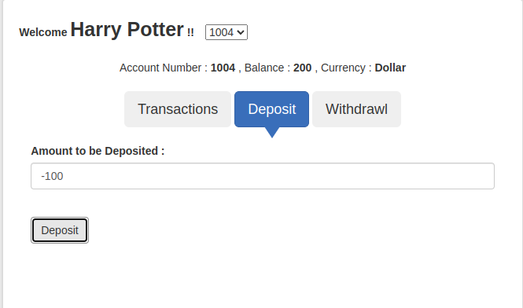
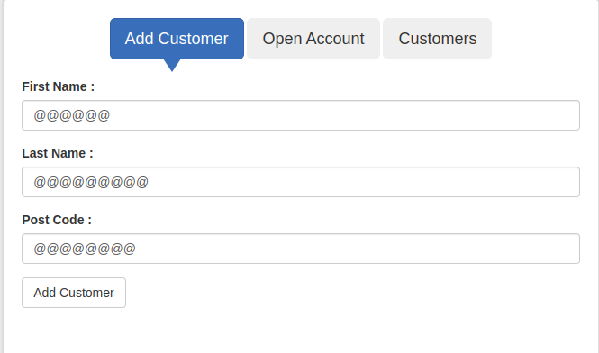
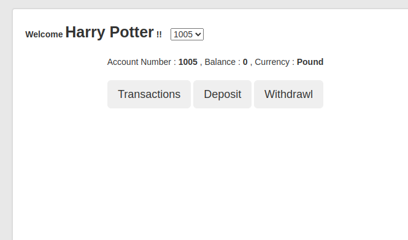
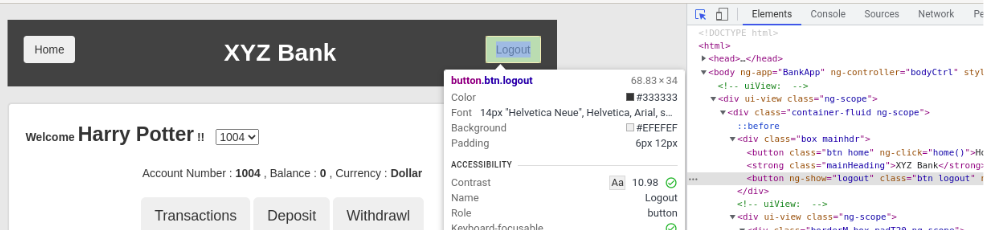
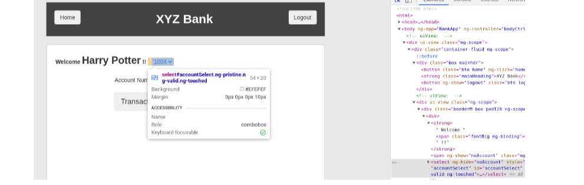
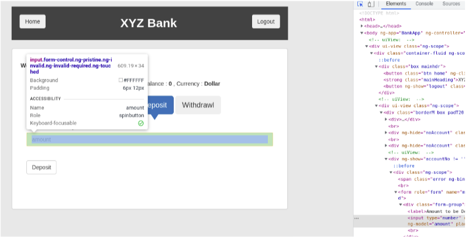
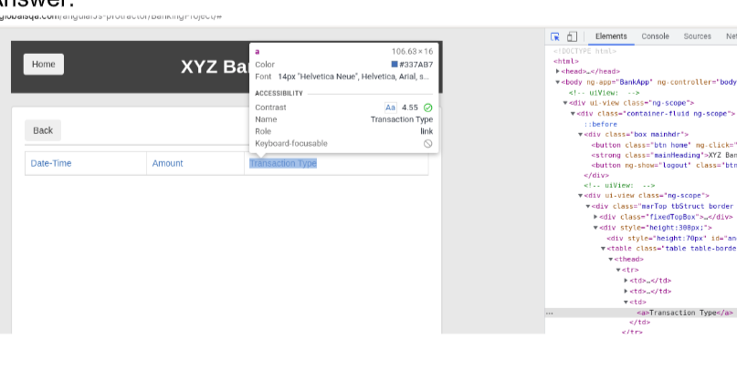
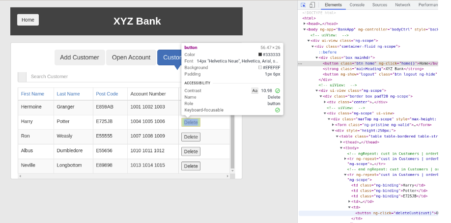
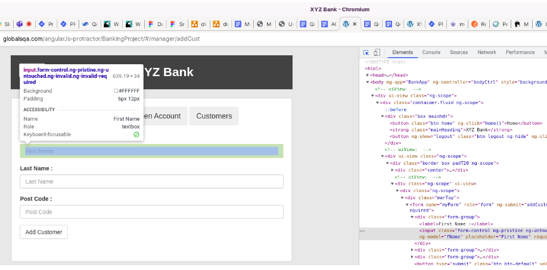

# Task 1:

## Bugs table

#### a. Find bugs as many as you can , write it down in form smth. like this. (Required 5)

| Id    | Description                                                                                                    | Step for reproduce                                                                                                                                                                                                                                                                                                              | Severity | Priority | Image                   |
|-------|----------------------------------------------------------------------------------------------------------------|---------------------------------------------------------------------------------------------------------------------------------------------------------------------------------------------------------------------------------------------------------------------------------------------------------------------------------|----------|----------|-------------------------|
| 1     | Checking for entering a negative number in the field for the deposit                                           | 1. Open page [Link](https://www.globalsqa.com/angularJs-protractor/BankingProject/#/login)<br/>2. Customer login<br/> 3. Select Harry Potter and click login<br/> 4. Click Deposit and write down negative amount<br/> 5. An error should be displayed stating that you cannot enter negative amount after click Deposit button | Major    | Medium   |  |
| 2     | Checking for entering different special characters in the fields for the first name, last name and postal code | 1. Open page [Link](https://www.globalsqa.com/angularJs-protractor/BankingProject/#/login)<br/>2. Bank manager login<br/> 3. Click button Add Customer<br/> 4. Enter in field different special symbols<br/> 5. Click Add Customer for save                                                                                     | Critical | High     |  |
| 3     | Different text for "Welcome" and username                                                                      | 1. Open page [Link](https://www.globalsqa.com/angularJs-protractor/BankingProject/#/login)<br/>2. Customer login<br/> 3. Select user and click login<br/>                                                                                                                                                                       | Low      | Low      |  |
| 4     |                                                                                                                |                                                                                                                                                                                                                                                                                                                                 |          |          |                         |
| 5     |                                                                                                                |                                                                                                                                                                                                                                                                                                                                 |          |          |                         |
| 6     |                                                                                                                |                                                                                                                                                                                                                                                                                                                                 |          |          |                         |

#### b. Input Xpath or Css selector (or both on your choice) for next elements(Do not use search by text):

- i. 
Answer: ```CSS SELECTOR: .btn.logout ```
- ii.  
Answer: ```XPATH: //select[@id='accountSelect'] ```
- iii.  
ANSWER: ```XPATH: //input[contains(@class,'form-control ng-pristine')]```
- iv.  
ANSWER: ```XPATH: //input[contains(@class,'form-control ng-pristine')]```
- v. 
ANSWER: ```XPATH: (//button[@ng-click='deleteCust(cust)'][normalize-space()='Delete'])[2]```
- vi.  
ANSWER: ```XPATH: //input[@ng-model='fName']```

# Task 2 (select one or more to implement)

#### Make Selenium + Python test with test case on your choice:

1. Customer Login - select Ron Weasly - Select another account - Deposit 100 $ - Transaction check-find deposit
   transaction - check that amount is correct - Logout - Site: Link here
2. Customer Login - select Harry Potter - Withdraw 100 $ - Transaction failed check - Deposit 100 $ - Transaction
   success check-find two deposit transaction - check that amount is correct - Logout - Site: Link here
3. Bank manager login - add new customer - find new customer in Customers tab - add new account for that new
   customer - Customer login - user can log in - new account present - Site: Link here
4. Select Category phones - Add to cart - Find in cart - Place order - Input data - Purchase - Site: Link here
